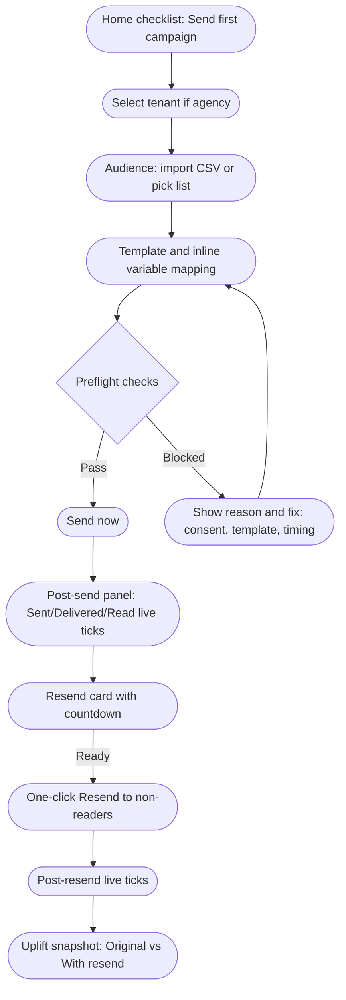
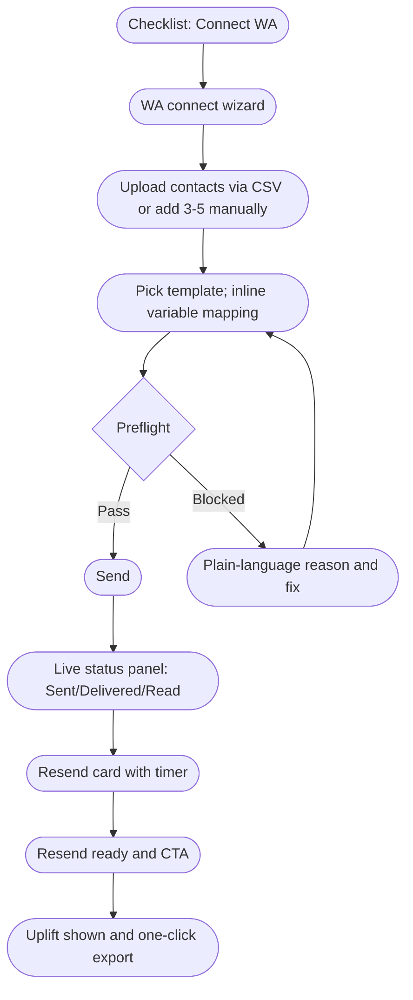
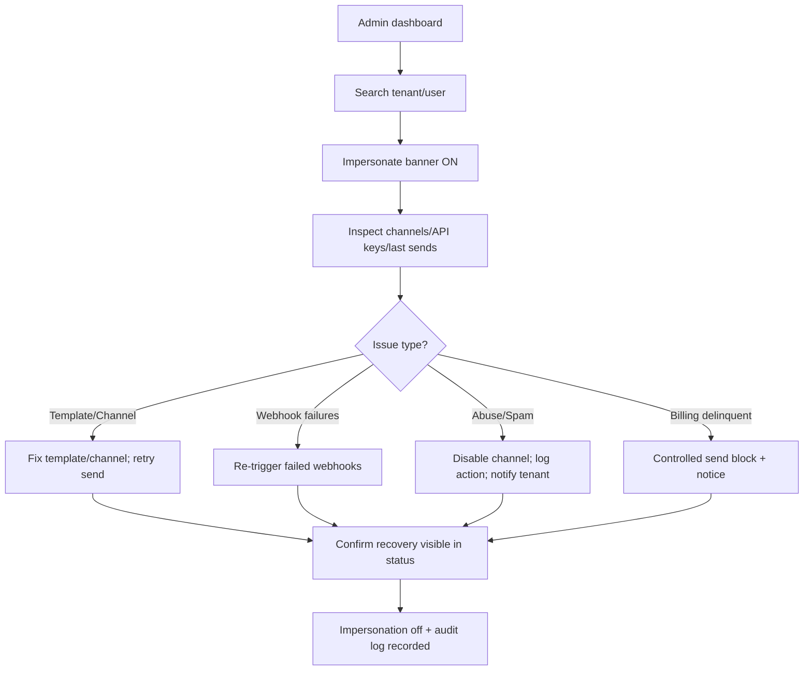

# UX Design Specification EngageNinja

**Author:** Jigs
**Date:** 2025-12-08

---

<!-- UX design content will be appended sequentially through collaborative workflow steps -->

## Executive Summary

### Project Vision
AI-first, WhatsApp-first engagement for agencies and WhatsApp-heavy SMBs: unify WA/email on one data model, ship campaigns in minutes, and drive resend uplift fast. Built to expand via adapters (CRM/Ads/Inbox) without rebuild.

### Target Users
Agency marketers/operators (execution, resend, AI assist); agency owners/directors (multi-tenant ROI oversight); SMB owners/staff (guided WA setup, simple dashboards); platform admins (impersonation/support); secondary ecom/SaaS/franchise as scale grows.

### Key Design Challenges
- WA connect + first send with consent/template checks, dedup, and micro-list support.
- Resend flow with guardrails (timing, consent, template approval) and clear uplift.
- Agency multi-tenant view with switcher, drill-down, revocation/audit visibility.
- Admin support/impersonation with safe controls and outage/webhook failure surfacing.

### Design Opportunities
- Guided WA onboarding that guarantees Day-0 send.
- Resend-first UX with uplift front and center.
- Agency dashboards that prove ROI per tenant and ease switching.
- Inline AI assist for copy without blocking progress.

## Core User Experience

### Defining Experience
One core loop to make effortless: Connect WhatsApp → Import contacts → Send first WhatsApp campaign → Resend non-readers → See uplift. All primary CTAs reinforce this loop; nothing else (email/automation/CRM/ads) should interrupt in MVP. Design KPIs: Time to Connect WA, Time to First Send, Time to First Resend, Resend Uplift %.

### Platform Strategy
Web-first (desktop) with responsive support for tablet/mobile. No native mobile app in MVP. Desktop-optimized, mobile-friendly (view dashboards, basic sends/resend, status checks). Touch-friendly tap targets for send/resend/view, but no touch-first gestures. No offline mode.

### Effortless Interactions
- WA connect wizard that guarantees completion and surfaces template approval status.
- CSV/manual import with dedup + consent checks, clear exclusions.
- Campaign send flow with template variable mapping and consent/approval guardrails.
- Resend flow with timing guardrails and one-click uplift view.
- Tenant switch + impersonation with clear banners and safe exit.

### Critical Success Moments
- First WA send in minutes: “Campaign sent successfully” + live delivery ticks.
- Resend uplift visible: “Original read 62% → After resend 74% (net +12%).”
- Agency ROI across tenants: One screen with tenants, sends, read rates, resends, trends.
- Admin recovery via impersonation: Fix channel/template, retry send, see recovery.

### Experience Principles
- Core loop first: Every path pulls users back to Connect → Import → Send → Resend → Uplift.
- Safety by default: Consent, template approval, resend timing, dedup, tenant isolation/impersonation clarity.
- Web-first clarity: Desktop flows prioritized; mobile-friendly for monitoring and resend, not heavy setup.
- Proof over promises: Always show uplift and ROI evidence; surface recovery status for admins.

## Desired Emotional Response

### Primary Emotional Goals
Confidence & control — “I can ship quickly, safely, and I know it’s working.”

### Emotional Journey Mapping
- First use: Guided confidence — clear steps, no dead ends, obvious next action, no jargon leaks.
- Core action (send/resend): Confident + protected — guardrails visible but helpful; clear “Allowed/Blocked & why”; timing/consent protections feel like help, not friction.
- After completion: Accomplished + validated — uplift shown with before/after; no ambiguity about results.
- When something breaks: Supported + recoverable — admin tools/impersonation visible; clear recovery path; “you’re not alone.”

### Micro-Emotions
- Efficient/productive: “I got more done in less time.”
- Relieved: “The system won’t let me make a costly compliance mistake.”
- Supported/trusted: “If something breaks, support can step in instantly.”
- Proud: “I can clearly show uplift and ROI.”
- Emotions to avoid: Anxiety about compliance/consent; doubt about WA delivery/read accuracy; frustration from blocked sends with no explanation, confusing template states, silent failures.

### Design Implications
- Always show system state: send status, remaining quota, template approval state; never hide it.
- Block with human-language reasons and next steps: “Template not approved yet”; “Resend too soon — wait 12 hours”; “Consent missing for 42 contacts.”
- Uplift/ROI must be obvious and one-click exportable; pride hinges on evidence.
- Support/impersonation must feel immediate, traceable, and safe (“Admin is investigating/support will step in”).
- Balance guardrails with soft delivery: don’t just block — show exactly how to unblock.

### Emotional Design Principles
- Neutralize hidden fears: number blocking, did-it-send, am-I-compliant.
- Evidence beats promise: make uplift and delivery/read verifiable and exportable.
- Safety with momentum: guardrails that guide, not obstruct.
- Recovery is reassurance: clear admin/support visibility and actionability.

## UX Pattern Analysis & Inspiration

### Inspiring Products Analysis
- WhatsApp Business / WA Cloud Console (SMB mental model of trust): Instant feedback (sent/delivered/read), zero clutter, contact-first UX. Lacks analytics, resend intelligence, and audit/compliance.
- HubSpot (agency trust & reporting): Onboarding checklists, clear lifecycle states (Draft → Scheduled → Sent → Performance), strong roles/permissions, client-ready reporting, auditability. Overwhelming UI and slow TTV; too many screens.
- Stripe (trust, errors, admin): Human-readable errors, clear state transitions, impersonation/admin tooling, transparent logs, confidence in recovery. Can be dev-heavy and config-heavy for SMBs.

### Transferable UX Patterns
- From WhatsApp: Clear delivery/read states; low-noise sending flows; customer-centric feel.
- From HubSpot: Onboarding checklists; lifecycle states; role clarity; exportable, client-presentable reports.
- From Stripe: Human-readable errors with reasons/next steps; strong impersonation + audit trails; transparent event logs and recoverability.

### Anti-Patterns to Avoid
- Silent failures; blocked actions without explanation; hidden compliance/template states.
- Analytics that require interpretation or overloaded dashboards.
- Slow feedback loops; feature bloat and menu sprawl; developer jargon for business users.
- Ambiguous resend timing/approval/consent states.

### Design Inspiration Strategy
- Adopt: WA clarity for delivery/read; HubSpot-style checklists/lifecycle and role/report professionalism; Stripe-level error clarity and recoverability.
- Adapt: Reporting to be lightweight and client-ready with one-click export; state transitions for campaigns/resends (e.g., Draft → Scheduled → Sending → Sent → Resend → Completed).
- Avoid: Overloaded dashboards and slow TTV—keep first send/resend visible and fast; no ambiguous blocking—always explain cause and fix; no dev-jargon for business users.

## Design System Foundation

### 1.1 Design System Choice
Themeable system using shadcn/ui + Tailwind tokens, with custom patterns for WA status, checklists, ROI dashboards.

### Rationale for Selection
- Aligns with existing stack (Next.js, Tailwind, shadcn) for speed.
- Accessible defaults and strong composability without Material/Ant heaviness.
- Easy to brand and differentiate via custom status chips, banners, and typography.

### Implementation Approach
- Tailwind tokens for color/spacing/typography/radii/shadows; shadcn primitives for forms, tables, dialogs, toasts.
- Custom components: WA delivery/read/status pills; resend callouts; onboarding checklists; uplift cards; tenant switcher; impersonation/admin banners; one-click export/report modules.
- Statefulness: Human-readable errors; inline guardrails; button states (allowed/blocked/why); lifecycle/status labels for campaigns/resends.

### Customization Strategy
- Visual: Trustful palette (greens/teals for success/reads), strong contrast for warnings/errors, neutral dashboards; restrained iconography; clear impersonation banners.
- Interaction: Inline explanations for blocks with next steps; uplift/export CTAs obvious; keep dashboards uncluttered with one primary chart/table per view; responsive but desktop-first layouts.

## Core User Experience (Defining Experience)

### Defining Experience
Hero loop: “Send with certainty → Optimize with resend → Prove uplift.” North star for MVP and should surface in onboarding, tours, and demos.

### User Mental Model
- WA certainty (delivery/read truth) + HubSpot lifecycle states + Stripe error clarity + Google-Docs safety (autosave, undo, no destructive surprises).

### Success Criteria
- Pre-flight: Send button clearly Enabled/Blocked/Waiting with explicit reason; pre-flight checklist (WA connected, template approved, consent coverage, recipient count) visible—no hidden validations.
- Post-send: Immediate panel with live Sent/Delivered/Read ticking; “Live” indicator while updates stream.
- Resend readiness: Resend card with countdown (“Resend available in Xh Ym”), rule “only non-readers included,” then CTA “Resend to N non-readers.”
- Uplift proof: Side-by-side snapshot (Original vs With resend, net uplift %) inline on campaign and dashboard; one-click export/share.

### Novel UX Patterns (EngageNinja Signatures)
- One-click inline resend from campaign row (confirm timing/template, then send—no wizard).
- Checklist-driven home screen (Connect WA, Upload contacts, Send first campaign, Resend non-readers) with inline expansion.
- Inline variable mapping: Template preview left, variables on the right; errors inline.

### Experience Mechanics
- Initiation: From home checklist “Send First Campaign” or “New Campaign”; 3-step linear flow (Audience → Template+Variables → Review+Send) with progress bar.
- Feedback during send: Button states (idle/hover with recipient count/disabled with reason/sending/sent); post-send panel pops in without redirect.
- Completion: Campaign row shows status + deliver/read percentages; toast confirms send; live counters persist.
- Resend: Auto-appearing card, countdown, button turns primary when ready; resend is faster (no audience reselection).
- Uplift completion: Original vs final with uplift %; immediate “Share/Export” button.

### Experience Principles (Defining Interaction)
- Hero loop first: Send → Resend → Prove uplift in every surface.
- Guardrails that guide: Block with human reasons and next steps (template pending, resend too soon, consent missing for X contacts).
- Evidence as default: Live delivery/read ticks; uplift shown side-by-side; exportable proof.
- Safety and recovery: Impersonation banners, admin/support visibility, autosave/undo cues.

## Visual Design Foundation

### Color System
- Brand/primary: Trustful greens/teals for success/read states; neutral grayscale for dashboards; clear warning/error hues for blocks and template/consent issues.
- Semantic tokens: primary, success (read/delivered), warning (pending/at-risk), danger (blocked/failed), info (live/streaming), neutral (backgrounds, borders).
- Status chips/banners: WA delivery/read status pills; impersonation/admin banners use high-contrast bar; resend timers use info/warning states.
- Accessibility: Maintain WCAG AA contrast on text/buttons; avoid low-contrast muted states for critical info.

### Typography System
- Typeface: Modern, legible sans such as Inter or DM Sans (web-safe fallbacks).
- Tone: Confident, professional, not playful; support dense data tables and clear CTAs.
- Scale (example): H1 32–36, H2 24–28, H3 20–22, body 14–16, caption 12–13; line-height 1.4–1.6 for readability.
- Usage: Titles for campaigns/reports; strong label + value pairs for metrics; monospace only for IDs/keys if needed.

### Spacing & Layout Foundation
- Grid: 8px base; desktop-first with responsive stacking; generous vertical rhythm on onboarding/checklists; tighter density on data tables.
- Components: Cards/panels with 16–24px padding; form rows on 8–12px rhythm; table rows at 48–56px height for scannability.
- Dashboards: One primary chart/table per view; secondary stats as compact chips; avoid overcrowding.
- Banners/toasts: Clear hierarchy; toasts for ephemeral confirmation; inline banners for blocking issues with next steps.

### Accessibility Considerations
- Focus states visible on all interactive elements; keyboard navigable forms and checklists.
- Clear, human-readable error copy with actionable next steps; avoid color-only signaling—pair with icons/text.
- Live updates (delivery/read ticking) should not trap focus; use polite ARIA live regions for status updates.

## Design Direction Decision

### Design Directions Explored
- Direction A: Clarity & Uplift — minimal, high-contrast surfaces; hero loop (Send → Resend → Prove uplift) always visible; live status chips; inline reasons.
- Direction B: Agency Ops — ops-first, tenant switcher + ROI per tenant, data-dense; onboarding checklist.
- Direction C: Guided Launch — wizard-like guidance with preflight safety rails and inline variable mapping.

### Chosen Direction
Direction A — Clarity & Uplift (primary). Borrow selective elements if needed: tenant switcher from B; preflight emphasis from C.

### Design Rationale
- Keeps the hero loop front-and-center with immediate visibility of delivery/read and uplift.
- High contrast and minimal noise match the trust/safety emotional goals.
- Inline reasons and live status chips reduce ambiguity and accelerate TTV.

### Implementation Approach
- Use the established Tailwind/shadcn foundation with Direction A styling: bold status chips, clear banners, minimal chrome.
- Keep a lightweight tenant switcher (from B) and retain preflight cards (from C) to support safety rails without clutter.
- Ensure hero dashboard surfaces uplift, resend readiness, and WA health prominently; maintain one primary chart/table per view.

## User Journey Flows

### Agency Marketer: Send → Resend → Uplift

### SMB Owner: Guided Quick Launch

### Platform Admin: Impersonation & Recovery

### Journey Patterns
- Entry via checklist or search/switcher; linear, low-branch flows.
- Inline, human-readable blockers with direct fixes; no hidden validations.
- Live feedback panels for sends/resends; side-by-side uplift snapshots.
- Impersonation always bannered; recovery actions end with visible confirmation and audit.

### Flow Optimization Principles
- Minimize steps to value: 3-step send flow; one-click inline resend.
- Keep safety visible but helpful: preflight checklist + explicit states (Allowed/Blocked/Waiting).
- Evidence by default: live ticks, uplift snapshots, one-click export.
- Recovery first: admin/support paths are obvious, bannered, and logged.

## Component Strategy

### Design System Components
- shadcn primitives on Tailwind: buttons, inputs, selects, dialogs/sheets, toasts/alerts, tables, cards, tabs, badges/chips, accordions, dropdowns, breadcrumbs, pagination, skeletons.

### Custom Components
- Preflight checklist card (WA connected, template approved, consent coverage, recipient count) with pass/block states.
- Send button with explicit states (ready/blocked/waiting/sending/sent) and inline reason text.
- Status chips for campaign/resend (sent/delivered/read, live indicator).
- Resend card (countdown, rule text, ready CTA).
- Uplift snapshot card (original vs with resend, net uplift, export CTA).
- Inline variable mapping pane (template preview + fields + inline errors).
- Onboarding checklist panel (Connect WA, Upload contacts, Send, Resend) with inline expansion.
- Tenant switcher bar + impersonation banner.
- Admin recovery panel (retry webhooks, disable channel, log action).
- Report export CTA module.
- Inline error/info banners with human-readable reasons and fixes.
- Campaign list table with inline resend CTA and live metrics.

### Component Implementation Strategy
- Build customs atop shadcn primitives; use tokens from visual foundation (color, spacing, typography, radii, shadows).
- States & accessibility: visible focus, aria-live for status updates; clear labels for buttons/banners; keyboard nav for mapping/checklists; toasts for ephemeral, banners for blocking.
- Variants: compact vs spacious for dashboards; primary/secondary buttons for action hierarchy; chips with status semantics.

### Implementation Roadmap
- Phase 1 (hero loop): Preflight checklist, send states, status chips, resend card, uplift snapshot, inline mapping, onboarding checklist, inline error banners, campaign table with inline resend.
- Phase 2: Tenant switcher + impersonation banner; admin recovery panel; report export module; richer tables/filters.
- Phase 3: Additional analytics widgets/segments; advanced filters; richer chart components as needed.
